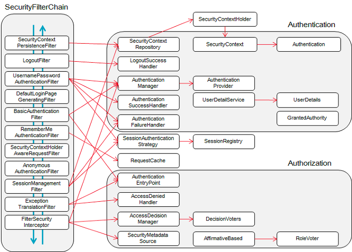

# 스프링 시큐리티와 JWT

## 📁 디렉토리 구조

| 폴더 / 파일 | 설명                   | 세부 폴더           |
|---------|----------------------|-----------------|
| web     | 외부 요청/응답에 대한 전반적인 영역 | dto, controller |
| service | 트랜잭션(@Transactional) | -               |
| domain  | 데이터 저장소에 접근하는 영역     | repository      |
| config  | 시큐리티 설정              | auth            |

## 🛹 전체적인 흐름

`JWT 토큰 발행을 위한 흐름`
> 로그인 요청 > CORS 필터 > 유효한(DB에 존재하는) 사용자인지 확인 > JWT 토큰 발행 > HTTP 헤더에 JWT 토큰을 포함하여 클라언트로 전송

`로그인 이후 사용자 인증의 흐름`
> 클라이언트 요청 > CORS 필터 > HTTP 헤더에 JWT 토큰이 존재하는지 확인 > 유효한(DB에 존재하는) 사용자인지 확인 > 시큐리티 세션 공간에
> authentication 객체를 저장 > 다음 시큐리티 필터로 이동

## 🔐 SpringSecurity

> 스프링 기반의 어플리케이션의 보안을 담당하는 스프링 하위 프레임 워크

### 기본 용어

● `Principal` : 보호된 리소스에 접근하는 대상 (접근 주체)    
● `Authentication` : 접근 주체가 누구인지, 어플리케이션의 작업을 수행해도 되는 주체인지 확인하는 과정   
● `Authorization` : 해당 리소스에 대한 접근 가능한 권한을 가지고 있는지 확인하는 과정(인증 이후 수행)

### 구조 및 필터



| 필터                                     | 설명                                                                                         |
|----------------------------------------|--------------------------------------------------------------------------------------------|
| SecurityContextPersistenceFilter       | SecurityContextRepository에서 SecurityContext를 로드하고 저장하는 일을 담당                               |
| LogoutFilter                           | 로그아웃 URL로 지정된 가상URL("/logout)에 대해 요청을 감시하고 매칭되는 요청이 있으면 사용자를 로그아웃 시킴                       |
| * UsernamePasswordAuthenticationFilter | 사용자명(username), 비밀번호(password)로 이뤄진 인증에 사용하는 가상URL("/login") 요청을 감시하고 요청이 있으면 사용자의 인증을 진행함 |
| DefaultLoginPageGenerationFilter       | Form기반, OpenID 기반 인증에 사용하는 가상URL에 대한 요청을 감시하고 로그인 폼 기능을 수행하는데 필요한 HTML을 생성함                |
| * BasicAuthenticationFilter            | HTTP 기본 인증 헤더를 감시하고 이를 처리함                                                                 |
| RequestCacheAwareFilter                | 로그인 성공 이후, 인증 요청에 의해 가로채어진 사용자의 원래 요청을 재구성하는 역할                                            |
| AnonymousAuthenticationFilter          | 이 필터가 호출되는 시점까지 사용자 인증을 받지 못하면, 요청 관련 인증 토큰에서 사용자는 익명 사용자로 나타나게 됨                          |
| SessionMangementFilter                 | 인증된 주체를 바탕으로 세션 추적을 처리해 단일 주체와 관련한 모든 세션들이 트래킹되도록 도움                                       |
| ExceptionalTranslationFilter           | 보호된 요청을 처리하는 동안 발생할 수 있는 기대한 예외의 기본 라우팅과 위임을 처리함                                           |
| FilterSecurityInterceptor              | 권한 부여와 관련한 결정을 AccessDecisionManger에게 위임해 권한 부여 결정 및 접근 제어 결정을 쉽게 만들어 줌                    |

### 📍 JWT 토큰 발행 과정 구현

1. dependency 추가

```
dependencies {
    implementation 'org.springframework.boot:spring-boot-starter-security' 
    implementation group: 'com.auth0', name: 'java-jwt', version: '3.10.3'

}
```

2. Configuration 설정

````java

@Configuration // 자바 기반의 설정 파일로 인식
@EnableWebSecurity // spring security filter chain에 자동으로 등록 됨
public class SecurityConfig extends WebSecurityConfigAdapter {
    // configure메서드를 오버라이딩하여 사용하고자 하는 시큐리티 규칙을 작성함
    @Override
    protected void configure(HttpSecurity http) throws Exception {
        http.csrf().disable(); // csrf 보안 설정 비활성화
        http.sessionManagement().sessionCreationPolicy(SessionCreationPolicy.STATELESS) // 세션 사용 비활성화
            .and()
            .addFilter(corsFilter) // CORS 해제 정책 필터 등록
            .formLogin().disable() // formLogin 요청 방식 비활성화
            .httpBasic().disable() // http basic 요청 방식 비활성화
            .addFilter(new JwtAuthenticationFilter(authenticationManager())) // 사용자 인증 확인 및 JWT 토큰 발행하는 필터 추가
            .addFilter(new JwtAuthorizationFilter(authenticationManager(), userRepository)) // JWT 토큰 유효성 검사 및 시큐리티 세션에 Authentication 객체 저장하는 필터 추가
            .authorizeRequests() // URL별 권한 관리를 설정하는 옵션의 시작점 => antMatchers 옵션을 사용할 수 있어짐
            // user라는 Role을 가진 Principal에 대한 인가 설정
            .antMatchers("/api/v1/user/**").access("hasRole('ROLE_USER') or hasRole('ROLE_MANAGER')  or hasRole('ROLE_ADMIN')")
            .antMatchers("/api/v1/manager/**").access("hasRole('ROLE_MANAGER') or hasRole('ROLE_ADMIN')")
            .antMatchers("/api/v1/admin/**").access("hasRole('ROLE_ADMIN')")
            .anyRequest().permitAll(); // 설정된 값들 이외 나머지 URL은 모두 접근 허용
    }
}
````

3. UserDetails 구현

> Spring Security에서 사용자 정보를 담는 인터페이스    
> 즉, ︎ Spring Security에서 구현한 클래스를 사용자 정보로 인식하고 인증 작업을 한다.

```java
package com.example.jwtstart.auth;

//...
@AllArgsConstructor
public class PrincipalDetails implements UserDetails {

    private final Users user;

    @Override
    public Collection<? extends GrantedAuthority> getAuthorities() {
        Collection<GrantedAuthority> authorities = new ArrayList<>();
        //...
        return authorities;
    }

    @Override
    public String getPassword() {
        return user.getPassword();
    }

    @Override
    public String getUsername() {
        return user.getUsername();
    }

    @Override
    public boolean isAccountNonExpired() {
        return true;
    }

    @Override
    public boolean isAccountNonLocked() {
        return true;
    }

    @Override
    public boolean isCredentialsNonExpired() {
        return true;
    }

    @Override
    public boolean isEnabled() {
        return true;
    }
}

```

4. UserDetailsService 구현

> DB에서 유저 정보를 가져오는 역할   
> 즉, loadUserByUsername()에서 DB의 유저 정보를 가져와서 구현한 UserService 형으로 사용자 정보를 반환하는 곳

```java

@Service
@RequiredArgsConstructor
public class PrincipleDetailsService implements UserDetailsService {
    private final UserRepository userRepository;

    @Override
    public UserDetails loadUserByUsername(String username) throws UsernameNotFoundException {
        Users userEntity = userRepository.findByUsername(username);
        return new PrincipalDetails(userEntity);
    }
}
```

5. 로그인 요청 시 사용자 정보 확인 및 JWT 토큰 발행

> UsernamePasswordAuthenticationFilter를 상속받아 구현

````java

@RequiredArgsConstructor
// `/login` 요청해서 useranme, password를 전송하면(post방식) UsernamePasswordAuthenticationFilter 동작
public class JwtAuthentiactionFilter extends UsernamePasswordAuthenticationFilter {

    private final AuthenticationManager authenticationManager;

    @Override
    public Authentication attemptAuthentication(HttpServletRequest request, HttpServletResponse response) throws AuthenticationException {

        try {
            // 1. JSON 형식으로 클라이언트로부터 username, password를 받음
            ObjectMapper om = new ObjectMapper();
            Users user = om.readValue(request.getInputStream(), Users.class);

            // 2. 1에서 받은 username과 password를 조합하여 UsernamePasswordAuthenticationToken 인스턴스를 만듦
            UsernamePasswordAuthenticationToken authenticationToken = new UsernamePasswordAuthenticationToken(user.getUsername(), user.getPassword());
            
            // 3. 앞서 생성한 토큰 검증을 위해 AuthenticationManager의 인스턴스로 전달되고, 인증에 성공하면 Authentication 인스턴스를 리턴함
            Authentication authentication = authenticationManager.authenticate(authenticationToken);
            
            // 4. Authentication 인스턴스를 세션에 저장 
            return authentication;

        } catch (IOException e) {
            e.printStackTrace();
        }

        return null;
    }


    @Override
    // 5. attemptAuthentication 실행 후 인증이 정상적으로 수행 된 후 successfulAuthentication 함수가 실행됨
    protected void successfulAuthentication(HttpServletRequest request, HttpServletResponse response, FilterChain chain, Authentication authResult) throws IOException, ServletException {

        PrincipalDetails principalDetails = (PrincipalDetails) authResult.getPrincipal(); // attemptAuthentication으로 부터 전달받은 Authentication 인스턴스를 통해 principal을 가져옴
        
        // 6. JWT 토큰 생성 
        String jwtToken = JWT.create()
            .withSubject("jwt_token") // 토큰명 설정
            .withExpiresAt(new Date(System.currentTimeMillis() + (만료시간))) // 토큰 만료시간 설정
            .withClaim("id", principalDetails.getUser().getId()) // claims(: 사용자에 대한 속성) 설정
            .withClaim("username", principalDetails.getUser().getUsername())
                .sign(Algorithm.HMAC256(SECRET_KEY)); // 서명 생성

        response.addHeader("Authorization", "Bearer " + jwtToken); // HTTP 헤더에 "Authorization" : "Bearer ..." (Key-value) 값으로 클라이언트에게 응답함
    }
}

````

### 📍 로그인 이후 사용자 인증 과정 구현 방법

JWT 토큰을 확인하고 권한을 부여함
> BasicAuthenticationFilter를 상속받아 구현

````java
public class JwtAuthorizationFilter extends BasicAuthenticationFilter {

    private  UsersRepository usersRepository;

    public JwtAuthorizationFilter(AuthenticationManager authenticationManager, UsersRepository usersRepository) {
        super(authenticationManager);
        this.usersRepository = usersRepository;
    }

    @Override
    protected void doFilterInternal(HttpServletRequest request, HttpServletResponse response, FilterChain chain) throws IOException, ServletException {
        String jwtHeader = request.getHeader("Authorization"); // HTTP 헤더의 Authorization키의 값을 가져옴

        // JWT 토큰이 비정상적인 경우
        if(jwtHeader == null || !jwtHeader.startsWith("Bearer ")){
            chain.doFilter(request,response); // 다음 필터체인으로 이동
            return;
        }

        // JWT 토큰이 정상적인 경우
        String jwtToken = jwtHeader.replace("Bearer ", ""); // Bearer를 제외한 실제 토큰 값만 추출
        // JWT 검증 => 검증 실패 시 exception 발생, 통과는 서명이 완료되었다는 것을 의미함
        String username = JWT.require(Algorithm.HMAC256(JwtProperties.SECRET)).build().verify(jwtToken).getClaim("username").asString();

        // username이 비어있지 않은지 체크
        if(username != null && !username.equals("")){
            Users user = usersRepository.findByUsername(username);
            PrincipalDetails principalDetails = new PrincipalDetails(user);

            // 이미 JWT 서명으로 무결성을 검증했으므로, username을 가지고 강제로 Authentication 인스턴스를 만듦
            Authentication authentication = new UsernamePasswordAuthenticationToken(principalDetails.getUsername(), null, principalDetails.getAuthorities() );

            // 시큐리티를 저장할 수 있는 세션 공간을 찾아 => authentication을 넣어줌 : 강제로 시큐리티의 세션에 접근하여앞서만든 authentication 객체를 저장함
            SecurityContextHolder.getContext().setAuthentication(authentication);

            chain.doFilter(request,response); // 다음 필터체인으로 이동
        }
    }
}

````
